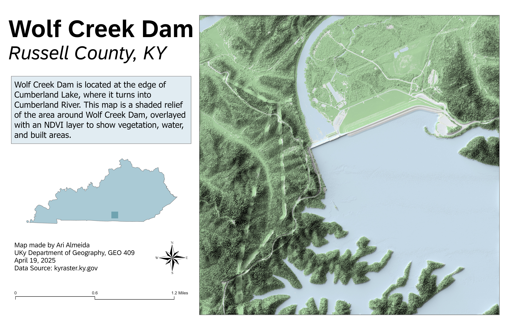

# Wolf Creek Dam in Cumberland Lake
## Russell County, KY

This map shows a colorized shaded relief of Wolf Creek Dam, located at the transition from Lake Cumberland to the Cumberland River in Russell County, Kentucky. An NDVI overlay highlights vegetation density, distinguishing vegetated areas, water bodies, and built-up areas.

     
*Wolf Creek Dam*

[Link to high-resolution GeoReferenced PDF](wolfCreekDam.pdf)     

**Map Author and Data Information:** Map created by Ari Almeida using ArcGIS Pro and Blender. Elevation and imagery data sourced from Kentucky's raster database (kyraster.ky.gov). Map produced for GEO 409, Department of Geography, University of Kentucky. April 19, 2025.